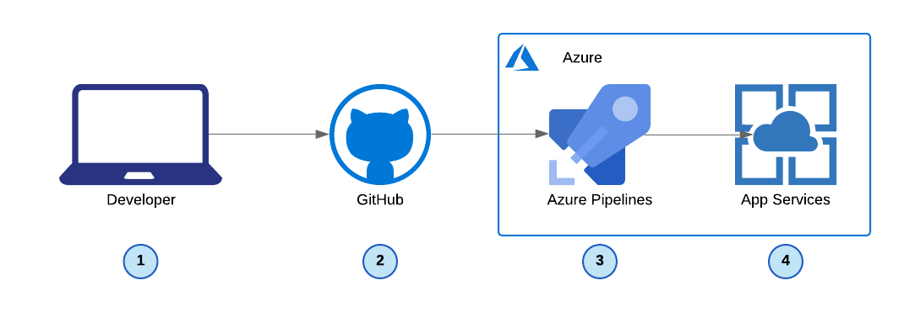
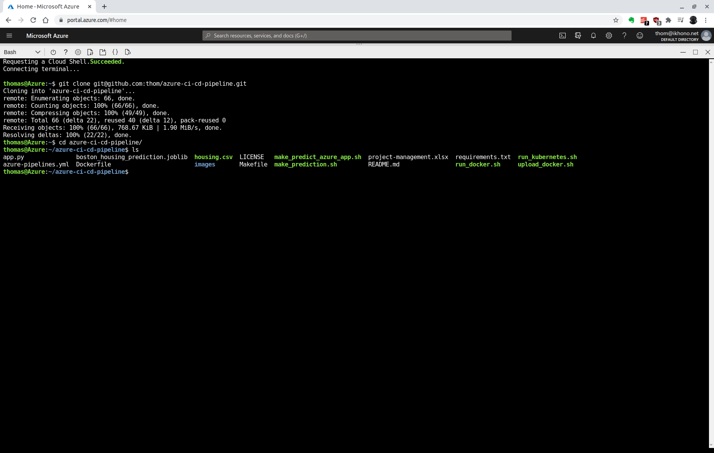
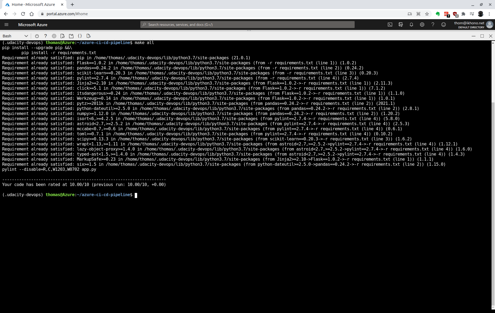
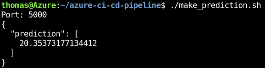
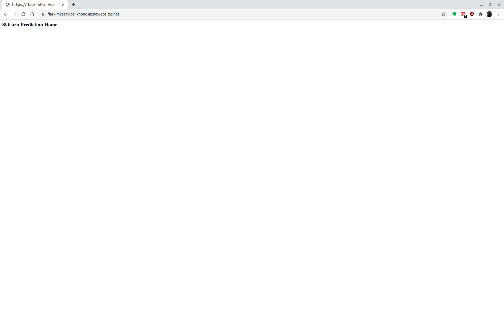
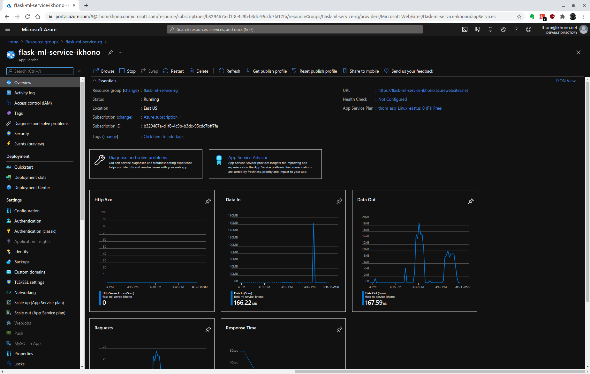

[](https://github.com/thom/azure-ci-cd-pipeline/actions/workflows/pythonapp.yml)

[](https://dev.azure.com/ikhono/Udacity%20Flask%20ML%20Deploy/_build/latest?definitionId=3&branchName=main)

# Udacity Cloud DevOps using Microsoft Azure Nanodegree Program - Project: Building a CI/CD Pipeline

- [Introduction](#introduction)
- [Getting started](#getting-started)
- [Dependencies](#dependencies)
- [Project plan](#project-plan)
- [Instructions](#instructions)
  - [Architectural overview](#architectural-overview)
  - [Test the web app in Azure Cloud Shell](#test-the-web-app-in-azure-cloud-shell)
  - [Deploy the web app to Azure App Services](#deploy-the-web-app-to-azure-app-services)
  - [Create Azure DevOps pipeline](#create-azure-devops-pipeline)
- [Clean-up](#clean-up)
- [Enhancements](#enhancements)
- [Demo](#demo)
- [References](#references)
- [Requirements](#requirements)
- [License](#license)

## Introduction

This project builds a continuous integration and continuous delivery delivery pipeline for a machine learning application implemented with scikit-learn
and Flask. The application provides Boston house price predictions.

Continuous integration is implemented using Github Actions along with a Makefile, requirements.txt and application code to perform an initial lint, test, and install cycle. The project builds an integration with Azure Pipelines to enable Continuous Delivery to Azure App Service.

## Getting started

1. Fork this repository
2. Ensure you have all the dependencies
3. Follow the instructions below

## Dependencies

The following are the dependecies of the project you will need:

- Create an [Azure Account](https://portal.azure.com)
- Install the following tools:
  - [Python](https://www.python.org/downloads/)
  - [Azure command line interface](https://docs.microsoft.com/en-us/cli/azure/install-azure-cli?view=azure-cli-latest)
  - [Visual Studio Code](https://code.visualstudio.com/)

## Project plan

- Spreadsheet with the estimated project plan: [Project Management Spreadsheet](https://github.com/thom/azure-ci-cd-pipeline/blob/main/project-management.xlsx)
- Trello board for task tracking: [Azure CI/CD Pipeline Board](https://trello.com/b/cvzyhixM/azure-ci-cd-pipeline)

## Instructions

### Architectural overview



1. The developer pushes the code to GitHub
2. GitHub Actions runs the following actions:
   - `make install`
   - `make lint`
   - `make test`
3. Azure Pipelines builds the project
   - Creates virtual Python environment
   - Installs all requirements
   - Runs `make install` and `make lint`
   - Deploys the web app to App Services
4. App Services serves the web app

### Test the web app in Azure Cloud Shell

Open a new Azure Cloud Shell and create new SSH keys to access the GitHub repository:

```bash
ssh-keygen -t rsa
```

Copy the contents of the new public key to your GitHub profile in settings:

```bash
cat ~/.ssh/id_rsa.pub
```

Fork this repository and adapt the following URL to match the path to your forked repository:

```bash
git clone git@github.com:thom/azure-ci-cd-pipeline.git
```



Change into the new directory:

```bash
cd azure-ci-cd-pipeline
```

Create a virtual Python environment and activate it:

```bash
make setup
source ~/.udacity-devops/bin/activate
```

Install all dependencies in the virtual environment and run tests:

```bash
make all
```



Run the application in the Azure Cloud Shell environment:

```bash
FLASK_APP=app.py flask run
```

Open a new Cloud Shell session and make a prediction:

```bash
./make_prediction.sh
```

The output should look like below:



### Deploy the web app to Azure App Services

In order to deploy the application to Azure App Service, you can run the following command:

```
az webapp up \
    --resource-group flask-ml-service-rg \
    --name flask-ml-service-ikhono \
    --sku F1 \
    --location eastus \
    --verbose
```

The name must be unique. If you visit the URL, you should see your site deployed:



If you want to update your app, make changes to your code and then run:

```
az webapp up \
    --name flask-ml-service-ikhono \
    --verbose
```

Screenshot of the web app in Azure:



### Create Azure DevOps pipeline

Follow [Use CI/CD to deploy a Python web app to Azure App Service on Linux](https://docs.microsoft.com/en-us/azure/devops/pipelines/ecosystems/python-webapp?view=azure-devops) in order to setup the Azure DevOps pipeline for the project.

You need to execute the following steps:

1. Go to [dev.azure.com](https://dev.azure.com/) and sign-in
2. Create a new project
3. Go to project settings and create a new service connection:
   - Select "Azure Resource Manager"
   - Select "Service principal (automatic)" as authentication method
   - Select your subscription and the "flask-ml-service-rg" resource group
   - Make sure to grant access permission to all pipelines
4. Create a new pipeline:
    - Select "GitHub" on the "Connect" tab
    - Chose your repository on the "Select" tab
    - Configure the pipeline as "Python to Linux Web App on Azure" and select the web app you created before

Required screenshots:

- Successful deploy of the project in Azure Pipelines. [Note the official documentation should be referred to and double checked as you setup CI/CD](https://docs.microsoft.com/en-us/azure/devops/pipelines/ecosystems/python-webapp?view=azure-devops).

- Running Azure App Service from Azure Pipelines automatic deployment

- Successful prediction from deployed flask app in Azure Cloud Shell. [Use this file as a template for the deployed prediction](https://github.com/udacity/nd082-Azure-Cloud-DevOps-Starter-Code/blob/master/C2-AgileDevelopmentwithAzure/project/starter_files/flask-sklearn/make_predict_azure_app.sh).
  The output should look similar to this:

```bash
udacity@Azure:~$ ./make_predict_azure_app.sh
Port: 443
{"prediction":[20.35373177134412]}
```

- Output of streamed log files from deployed application

## Clean-up

The easiest way to clean-up all resources created in this project, is to delete the resource group:

```bash
az group delete -n flask-ml-service-rg
```

## Enhancements

<TODO: A short description of how to improve the project in the future>

## Demo

<TODO: Add link Screencast on YouTube>

## References

- [Build continuous integration (CI) workflows by using GitHub Actions](https://docs.microsoft.com/en-us/learn/modules/github-actions-ci)
- [Manage repository changes by using pull requests on GitHub](https://docs.microsoft.com/en-us/learn/modules/manage-changes-pull-requests-github)
- [Implement a code workflow in your build pipeline by using Git and GitHub](https://docs.microsoft.com/en-us/learn/modules/implement-code-workflow)

## Requirements

Graded according to the [Project Rubric](https://review.udacity.com/#!/rubrics/2860/view).

## License

- **[MIT license](http://opensource.org/licenses/mit-license.php)**
- Copyright 2021 © [Thomas Weibel](https://github.com/thom).
